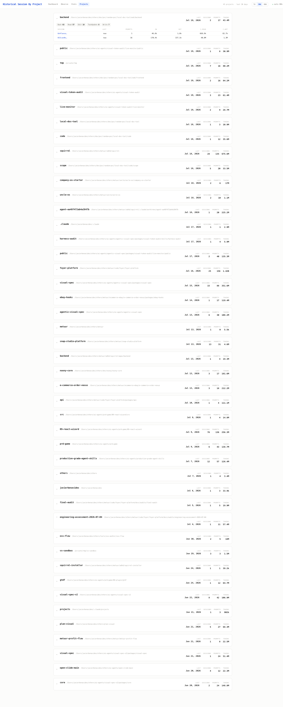
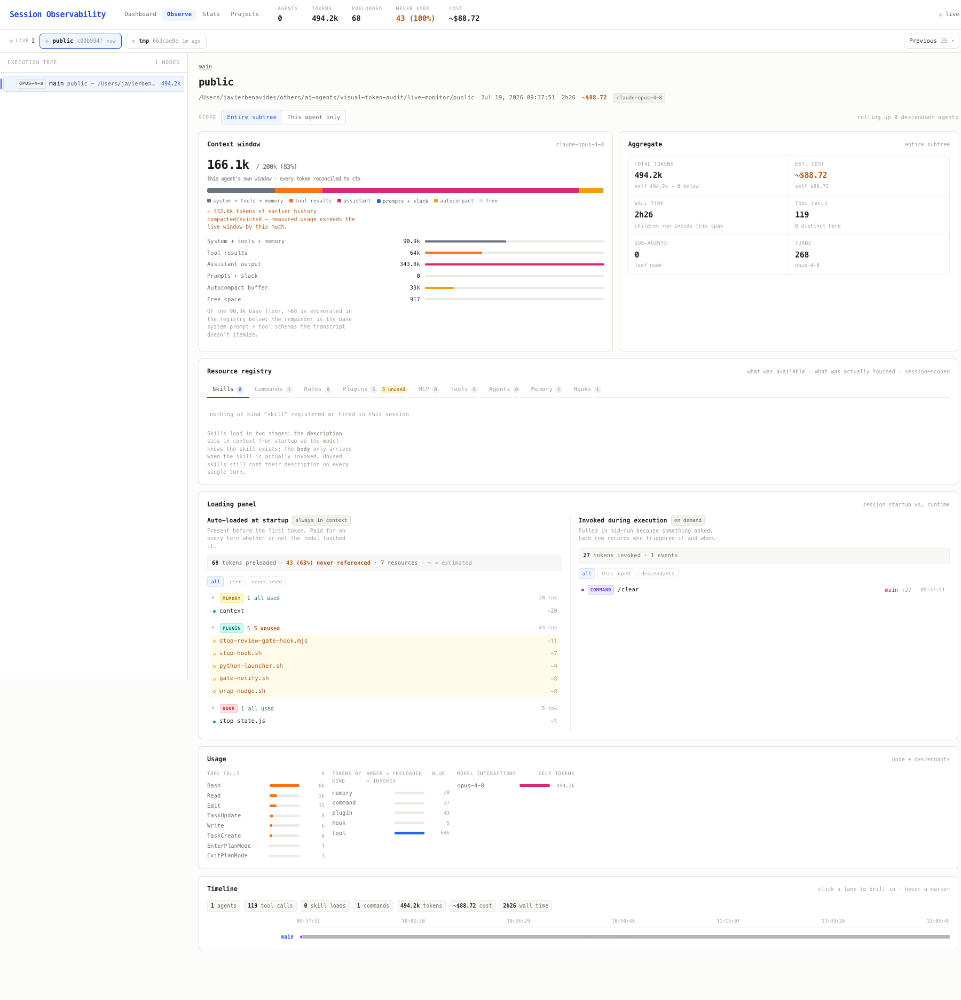
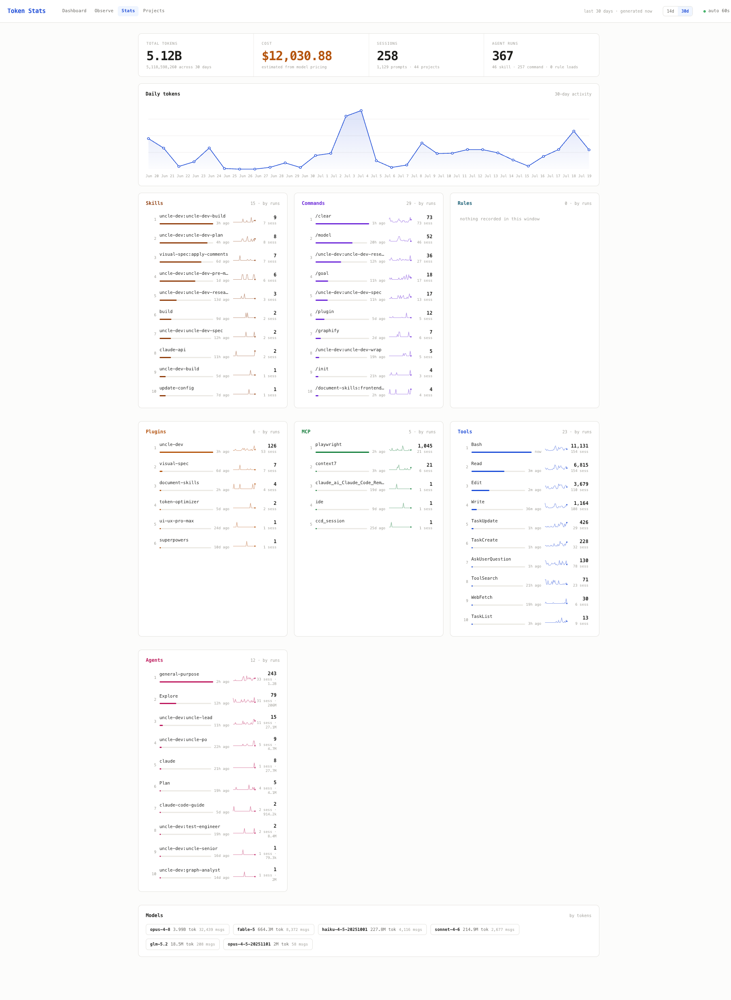

# Live Monitor — Collector (server)

A zero-dependency [Bun](https://bun.sh) server that tails your Claude Code and Codex
session transcripts in real time and exposes them over HTTP + Server-Sent Events
for the dashboard UI.

## Install Globally

```sh
npm install -g @metuur/claude-live-monitor
```

## Run

Anywhere with **Node ≥18** (no Bun needed):

```sh
npx claude-live-monitor
```

Or from a checkout, with either runtime:

```sh
bun run collector.ts     # Bun (dev, no build step)
npm run build && node bin/cli.js   # Node (builds dist/, then runs)
```

Then open **http://127.0.0.1:8722** in a browser.

### Background service

After a global install, run these commands from any directory:

```sh
claude-live-monitor start
claude-live-monitor status
claude-live-monitor stop
```

Both Claude Code and Codex sessions are monitored. `codex-live-monitor` remains an
alias with the same commands.

To install the current checkout globally before these changes are published:

```sh
cd live-monitor
npm run build
npm install -g .
claude-live-monitor start
```

To run directly from the repository root without installing globally (building
requires Bun; the background service runs on Node):

```sh
cd live-monitor
npm run build
npm run start:background
npm run status
npm run stop
```

The equivalent direct commands are `node bin/cli.js start`, `node bin/cli.js status`,
and `node bin/cli.js stop`. `npm start` continues to run in the foreground with Bun.
Use the checkout commands for local changes that have not been published yet.

`start` detaches the service so it continues after the terminal closes. Repeating
`start` or `stop` is safe. Without a command, the monitor runs in the foreground.
`status` exits with code 0 when running and 1 when stopped. This does not install
a login or reboot service; run `start` again after restarting your computer.

Logs and private control state live in `~/.claude-live-monitor/`, one instance per
port. For the default port, the log is `~/.claude-live-monitor/8722.log`.
Override this directory with `MONITOR_STATE_DIR`; use the same directory for every
command. For a custom port, use that same value for every command:

```sh
MONITOR_PORT=9000 npm run start:background
MONITOR_PORT=9000 npm run status
MONITOR_PORT=9000 npm run stop
```

The background process inherits `CODEX_HOME` and `CLAUDE_PROJECTS_DIR` at startup.
If a foreground monitor already occupies the port, stop it with Ctrl+C first.
`stop` only controls instances launched with `start`.

To restart after code changes, run `npm run stop`, `npm run build`, then
`npm run start:background`. If startup fails, the command reports the log path;
check it for details such as a port already in use.

The collector runs identically on Bun and Node: it uses `Bun.serve` when run
under Bun and adapts the same handler onto `node:http` otherwise. `npm run build`
bundles `collector.ts` → `dist/collector.js` and copies `public/` → `dist/public/`;
that `dist/` is what `npx` ships and runs.

> If the dashboard hasn't been built yet, `/` returns a `503 "UI not built yet"`
> placeholder — the API endpoints below still work regardless.

## Source layout

`collector.ts` is a thin entry point: it resolves the `public/` directory and
wires the pieces together. The implementation lives in `src/*.ts`, one concern per
module — `config`, `types`, `util`, `cost`, `parse`, `state` (the shared ring
buffer + session stores), `watch` (file tailing), the `tree` / `session-detail` /
`observe` / `stats` / `projects` / `projects-endpoint` builders, and `server`
(HTTP + SSE). `bun build` bundles them all back into a single `dist/collector.js`.

## Environment variables

| Var | Default | Meaning |
|---|---|---|
| `MONITOR_PORT` | `8722` | Port to listen on (host is always `127.0.0.1`). |
| `MONITOR_STATE_DIR` | `~/.claude-live-monitor` | Background service logs and private control state; use the same directory for start, status, and stop. |
| `CODEX_HOME` | `~/.codex` | Codex data directory; reads `sessions/` and `archived_sessions/`. |
| `CLAUDE_PROJECTS_DIR` | `~/.claude/projects` | Claude transcript directory. |

## What it watches

- `~/.claude/projects/**/*.jsonl` — Claude Code writes one JSONL transcript per
  session under a per-project directory whose name is a slug of the project cwd
  (e.g. `-Users-you-others-foo-bar`).
- `$CODEX_HOME/sessions/**/*.jsonl` and `$CODEX_HOME/archived_sessions/**/*.jsonl`
  — Codex rollout logs (default home: `~/.codex`).
- **First scan:** parses complete newline-terminated records from files modified
  in the last 48h, oldest-file-first so the ring ends with the newest activity.
  Older files are registered at EOF (no history replay) but still stream new appends.
- **Live:** a recursive `fs.watch` on the projects dir triggers incremental reads
  of only the newly-appended bytes per file (byte-offset tracked per file, partial
  trailing lines buffered until the next newline).
- **Fallback:** a 15s periodic rescan catches brand-new files/dirs that
  `fs.watch` can miss on macOS, and re-checks known files for appends.
- File truncation/rotation (stored offset > current size) resets to EOF without
  replaying.

## Web pages

The dashboard is a set of static pages served from `public/` (each returns the
`503 "UI not built yet"` placeholder if `dist/` hasn't been built). Every page has
a matching `.js` served alongside it.

| Route | Page |
|---|---|
| `GET /` | Live event feed (`index.html` + `app.js`) |
| `GET /observe` (`/observe.html`) | Context / token observation view (`observe.js`) |
| `GET /stats` (`/stats.html`) | Usage stats over a day window (`stats.js`) |
| `GET /projects` (`/projects.html`) | Per-project session index (`projects.js`) |
| `GET /vendor/<file>.js` | Bundled front-end vendor scripts |

## Screenshots

**Projects** — sessions grouped per project over a day window, each group a collapsible table.



**Observe** — per-session context-window and token breakdown: recency registry, loading panel, usage, and timeline.



**Stats** — usage aggregates over a day window: daily tokens plus top tools, commands, skills, agents, and models.



## HTTP API

| Route | Response |
|---|---|
| `GET /api/snapshot` | `{ events: MonitorEvent[], sessions: SessionAgg[], startedAt }` — full ring buffer (last 5000 events) + per-session aggregates |
| `GET /api/session/<id>` | Per-session detail tree (tool / sub-agent attribution). `404 { error }` for an unknown id |
| `GET /api/observe/<id>` | Per-session context / token breakdown. `404 { error }` for an unknown id |
| `GET /api/stats?days=N` | Usage aggregates over the last `N` days (`days` clamped to 1–30, default 14) |
| `GET /api/projects?days=N` | Sessions grouped by project over the last `N` days (`days` clamped to 1–60, default 30); envelope `{ projects, startedAt, days }`. History beyond the in-memory ~48h window is filled from an on-disk scan |
| `GET /events` | SSE stream. Each message is `id: <n>\ndata: <JSON MonitorEvent>\n\n`. Honors the `Last-Event-ID` request header (replays buffered events with a greater id before going live). Sends `: keepalive\n\n` every 25s. |

See `CONTRACT.md` for the exact `MonitorEvent` / `SessionAgg` schemas.

## Observed transcript fields

The parser was written against **real** transcripts, not assumptions. Confirmed
shapes (Bun 1.3.x, transcript format mid-2026):

- Every event line: `type`, `timestamp` (ISO-8601), `sessionId`, `cwd`.
  Project name = `basename(cwd)` when present, else decoded from the dir slug.
- `type:"assistant"` → `message.model` (e.g. `claude-fable-5`),
  `message.usage.{input_tokens, output_tokens, cache_read_input_tokens,
  cache_creation_input_tokens}`, and `message.content[]` blocks of type
  `thinking` / `text` / `tool_use` (tool_use has `name` + `input`). Tool names go
  into `tools`; a `tool_use` named `Skill` sets `skill` from its input.
- `type:"user"` → `message.content` is either a **string** (a prompt →
  `kind:"prompt"`) or an **array** containing `{type:"tool_result", tool_use_id,
  content, is_error}` blocks (→ `kind:"tool_result"`). `isMeta:true` lines
  (injected caveats) are skipped.
- `type:"system"` → surfaced only when it carries output/hook errors.
- Non-event line types present in transcripts and **skipped**: `last-prompt`,
  `mode`, `permission-mode`, `ai-title`, `file-history-snapshot`, `attachment`,
  `summary`.

Malformed JSON lines are skipped silently; all parse and IO is wrapped in
try/catch and logged to stderr — the watcher never crashes on bad input.

## Security note

- Binds **localhost only** (`127.0.0.1`). Not exposed to the network.
- **Read-only**: it reads your Claude Code transcripts (which may contain prompt
  text, tool inputs, and file paths) and serves snippets/aggregates locally. It
  never writes to or modifies transcripts. No auth is applied because it is not
  reachable off-host — do not port-forward or reverse-proxy it to the internet.

## Codex monitoring

Run the source build to use this addition (an already-published package will not
include local changes):

```sh
cd live-monitor
npm run build
node bin/cli.js
```

The dashboard's provider selector filters its sessions, totals, and activity feed.
Projects and Observe label each session; Stats shows totals for each provider.
After installation, `codex-live-monitor` is an alias of `claude-live-monitor`;
both commands start the same combined monitor.

Codex normalization uses `session_meta` for identity/cwd, `turn_context` for the
model, `response_item` for messages and function/custom tool calls/results, and
`event_msg.token_count` for usage. A stateful adapter is shared by the live and
historical readers. Codex session IDs have a `codex:` prefix to avoid collisions.

- Cumulative usage is converted to increments. Repeated token-count updates and
  the duplicate `token_usage_record` stream do not add tokens again.
- `input` means fresh input. Cached reads and cache writes are subtracted from
  Codex's inclusive input and shown separately. Summing input, output, cache read,
  and cache write gives total usage without double counting.
- `usage.reasoning` is a subset of output, displayed separately in Codex Observe
  and session detail. It is never added again to total usage.
- Context uses the last request's input count and the capacity reported by Codex.
  It does not use the cumulative session input as context occupancy.
- Codex billed cost and Claude-specific startup inventory estimates are
  unavailable. Mixed Stats reports `cost: null`, with the Claude estimate in
  `knownCost` and the unpriced Codex token count in `unpricedTokens`.
- Codex child rollouts with `source.subagent.thread_spawn.parent_thread_id`
  (or `spawn.parent_thread_id`) appear in the parent execution tree. Selecting a child
  shows its details within the parent session tree. Independent sessions remain separate.
- Archived rollouts contribute to history; moving a watched rollout into the
  archive preserves its counters. Historical Codex session links load on demand.
- Only local rollout data is monitored. Account subscription limits and cloud
  sessions without local rollouts are not inferred from token counts.

Missing provider directories are harmless; the periodic rescan finds them when
created. No API keys, transcript changes, or additional runtime dependencies are
required. Logs remain read-only and served only on localhost.

## Validation

```sh
npm test
```

`npm test` builds first, then runs the Bun test suite. Background service tests
cover start/status/stop, duplicate commands, stale state, and occupied ports with
an isolated temporary instance.

The Codex integration test uses temporary transcript directories and exercises
mixed-provider totals, historical date boundaries, SSE updates, partial lines,
and archive moves. Parser fixtures cover repeated counters, model changes,
reasoning/cache accounting, injected context, and tool-call/result linkage.

### Codex Observe details

Observe now preserves startup skill descriptions and instruction blocks from the
rollout and provides expandable Tools, Commands, Plugins, Skills, MCP, Agents,
Instructions, and Hooks tabs. Tool details include call IDs, input previews (up to
12,000 characters), result previews (up to 6,000 characters), bytes, and elapsed
time. The latest 200 retained calls are exposed; session token totals remain
cumulative even when the 4,000-line activity buffer is truncated.

Skill references link to matching tool-call input paths. Plugins are grouped by
namespaces in the recorded skill catalog. Shell requests inside `exec` retain
the wrapper source; nested tool names are source references, not independently
confirmed executions. Empty categories mean no retained evidence, not proof of
non-use. Ordinary outer calls now appear on the timeline. Account billing and
resource-specific billed tokens remain unavailable.

Observe shows only skills with recorded tool-call references and plugin namespaces
linked to those skills. Catalog-only entries are excluded from rows and tab counts;
the separate available-skills list is not displayed. Startup instruction blocks
remain visible because they were injected into the session.

The Subagent breakdown table lists descendants with their parent, model, own
token totals, fresh/cached input, output, reasoning subset, tool-call counts, and
elapsed time. Select a row to inspect that agent within the parent tree.
Empty sessions show an explicit no-child-executions message.

Observe lists only parent sessions in its picker. Child nodes carry their own
resource/call evidence, and selection keeps the parent session URL and execution
tree. Links to known child sessions resolve to their parent session.

Guardian/auto-review sessions also attach to their parent using the top-level
`session_meta.payload.parent_thread_id`, even when `source.subagent` only carries
`other: "guardian"`. The rollout `id` remains the child identity; `session_id`
may identify its parent and must not replace it.

Guardian agents expose a Reviews tab containing recorded decisions, risk levels,
authorization classifications, rationales, and request previews. These are public
assistant response records, not internal reasoning. The tab is selected by default
when review activity exists but no skill activity does. A guardian with no direct
tool invocations correctly retains zero tool/skill counts.
